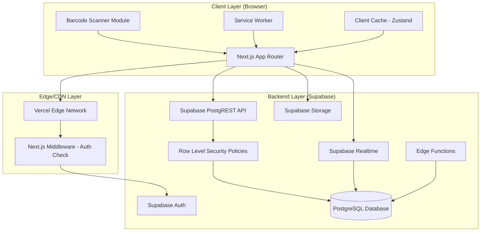
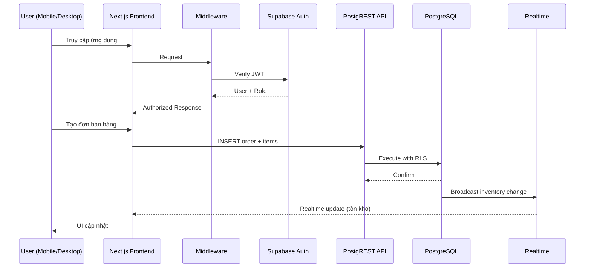
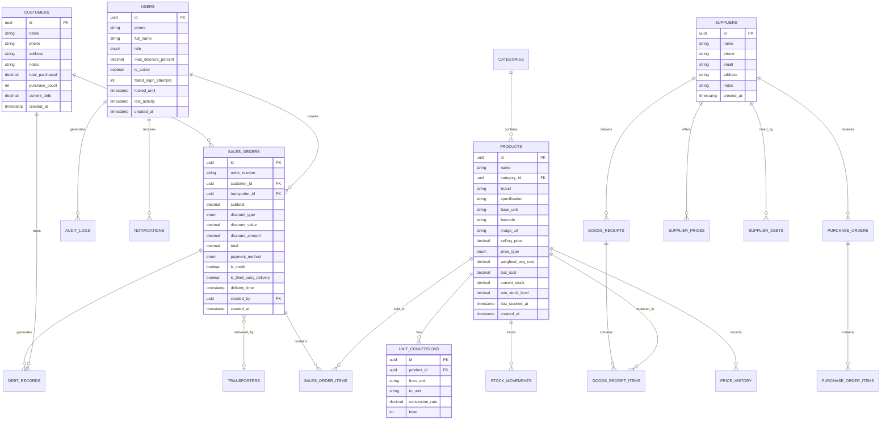

# Design Document

## Overview

Hệ thống Quản lý Cửa hàng Điện Nước là một ứng dụng web responsive, thiết kế theo kiến trúc client-server hiện đại, sử dụng **Next.js** (App Router) cho frontend và **Supabase** (PostgreSQL + Auth + Realtime + Storage) cho backend. Hệ thống phục vụ 2 vai trò chính: Chủ cửa hàng (Owner) và Nhân viên bán hàng (Staff), với giao diện tiếng Việt và thiết kế mobile-first.

### Mục tiêu thiết kế

- **Mobile-first**: Ưu tiên trải nghiệm trên điện thoại cho chức năng bán hàng và tra cứu giá
- **Realtime**: Tồn kho và giá cập nhật theo thời gian thực qua Supabase Realtime
- **Bảo mật**: Phân quyền ở cả tầng UI và database (Row Level Security)
- **Hiệu suất**: Tải trang < 3s trên 4G, quét mã vạch < 1s, tìm kiếm < 2s
- **Mở rộng**: Hỗ trợ từ < 1,000 đến hàng chục nghìn SKU

### Công nghệ chính

| Thành phần | Công nghệ | Lý do chọn |
|---|---|---|
| Frontend Framework | Next.js 14+ (App Router) | SSR/SSG cho hiệu suất, React ecosystem, SEO |
| UI Library | Tailwind CSS + shadcn/ui | Mobile-first responsive, component library nhẹ |
| Backend/Database | Supabase (PostgreSQL) | Auth tích hợp, Realtime subscriptions, RLS, Storage |
| Barcode Scanner | @ericblade/quagga2 | Hỗ trợ EAN, CODE 128, UPC-A qua camera, pure JS |
| State Management | Zustand | Nhẹ, đơn giản, phù hợp cho POS state |
| Push Notifications | Web Push API + Service Worker | Native browser support, không cần app store |
| Testing | Vitest + fast-check | Unit/property-based testing |
| Deployment | Vercel (Frontend) + Supabase Cloud | Zero-config deployment, global CDN |

---

## Architecture

### Kiến trúc tổng quan



### Luồng dữ liệu chính



### Phân tầng ứng dụng

1. **Presentation Layer**: Next.js pages/components, responsive layouts, Tailwind CSS
2. **Application Layer**: React hooks, Zustand stores, business logic utilities
3. **Data Access Layer**: Supabase client, API calls, realtime subscriptions
4. **Database Layer**: PostgreSQL tables, RLS policies, triggers, functions

---

## Components and Interfaces

### Module Structure

```
src/
├── app/                          # Next.js App Router
│   ├── (auth)/                   # Auth pages (login)
│   ├── (dashboard)/              # Protected pages
│   │   ├── pos/                  # POS - Bán hàng
│   │   ├── inventory/            # Tồn kho
│   │   ├── products/             # Sản phẩm
│   │   ├── purchasing/           # Nhập hàng & Đặt hàng
│   │   ├── customers/            # Khách hàng
│   │   ├── debts/                # Công nợ
│   │   ├── returns/              # Trả hàng
│   │   ├── reports/              # Báo cáo
│   │   ├── notifications/        # Thông báo
│   │   ├── settings/             # Cài đặt
│   │   └── audit-log/            # Nhật ký
│   ├── api/                      # API routes (if needed)
│   └── layout.tsx                # Root layout
├── components/
│   ├── ui/                       # shadcn/ui components
│   ├── pos/                      # POS-specific components
│   ├── barcode/                  # Barcode scanner
│   ├── inventory/                # Inventory components
│   └── shared/                   # Shared components
├── lib/
│   ├── supabase/                 # Supabase client config
│   ├── hooks/                    # Custom React hooks
│   ├── stores/                   # Zustand stores
│   ├── utils/                    # Utility functions
│   └── types/                    # TypeScript types
└── services/
    ├── inventory.service.ts      # Inventory business logic
    ├── pos.service.ts            # POS business logic
    ├── pricing.service.ts        # Pricing calculations
    ├── auth.service.ts           # Auth helpers
    └── notification.service.ts   # Notification logic
```

### Key Interfaces

```typescript
// === Product & SKU ===
interface Product {
  id: string;
  name: string;
  category_id: string;
  brand: string;
  specification: string;
  base_unit: string;
  barcode?: string;
  image_url?: string;
  description?: string;
  selling_price: number;
  price_type: 'fixed' | 'variable';
  weighted_avg_cost: number;
  last_cost: number;
  min_stock_level: number;
  current_stock: number;
  created_at: string;
  updated_at: string;
}

interface UnitConversion {
  id: string;
  product_id: string;
  from_unit: string;
  to_unit: string;
  conversion_rate: number;
  level: 1 | 2 | 3; // Tối đa 3 cấp quy đổi
}

// === POS / Sales ===
interface SalesOrder {
  id: string;
  order_number: string;
  customer_id?: string;
  items: SalesOrderItem[];
  subtotal: number;
  discount_type?: 'fixed' | 'percentage';
  discount_value?: number;
  discount_amount: number;
  total: number;
  payment_method: 'cash' | 'transfer';
  is_credit: boolean; // Mua nợ
  transporter_id?: string;
  is_third_party_delivery: boolean;
  delivery_time?: string;
  created_by: string;
  created_at: string;
  status: 'completed' | 'returned_partial';
}

interface SalesOrderItem {
  id: string;
  order_id: string;
  product_id: string;
  quantity: number;
  unit: string; // Đơn vị bán (có thể khác đơn vị cơ bản)
  unit_price: number;
  line_total: number;
  returned_quantity: number;
}

// === Inventory ===
interface StockMovement {
  id: string;
  product_id: string;
  movement_type: 'sale' | 'purchase' | 'return' | 'adjustment';
  quantity: number; // Positive for in, negative for out
  unit: string;
  reference_id: string; // Order/Receipt ID
  created_by: string;
  created_at: string;
}

// === Purchasing ===
interface PurchaseOrder {
  id: string;
  supplier_id: string;
  items: PurchaseOrderItem[];
  status: 'draft' | 'pending' | 'received' | 'partial';
  notes?: string;
  created_by: string;
  created_at: string;
}

interface GoodsReceipt {
  id: string;
  purchase_order_id?: string;
  supplier_id: string;
  items: GoodsReceiptItem[];
  promotional_items?: PromotionalItem[];
  defective_items?: DefectiveItem[];
  status: 'confirmed' | 'pending';
  created_by: string;
  created_at: string;
}

// === Customer & Debt ===
interface Customer {
  id: string;
  name: string;
  phone: string;
  address?: string;
  notes?: string;
  total_purchased: number;
  purchase_count: number;
  current_debt: number;
  created_at: string;
}

interface DebtRecord {
  id: string;
  customer_id: string;
  order_id: string;
  amount: number;
  paid_amount: number;
  remaining: number;
  due_date?: string;
  status: 'pending' | 'partial' | 'paid';
  created_at: string;
}

// === Auth & User ===
interface UserProfile {
  id: string;
  phone: string;
  full_name: string;
  role: 'owner' | 'staff';
  max_discount_percent?: number; // Giới hạn giảm giá cho staff
  is_active: boolean;
  created_at: string;
}

// === Notifications ===
interface Notification {
  id: string;
  user_id: string;
  type: 'low_stock' | 'overdue_debt' | 'order_arrived' | 'price_changed' | 'stale_stock';
  title: string;
  message: string;
  reference_id?: string;
  reference_type?: string;
  is_read: boolean;
  created_at: string;
}

// === Audit Log ===
interface AuditLog {
  id: string;
  user_id: string;
  action: 'create' | 'update' | 'delete';
  entity_type: string;
  entity_id: string;
  changes: Record<string, { old: any; new: any }>;
  created_at: string;
}
```

### Barcode Scanner Component Interface

```typescript
interface BarcodeScannerProps {
  onScan: (barcode: string) => void;
  onError?: (error: Error) => void;
  isActive: boolean;
}

// Hook for barcode scanning
function useBarcodeScanner(): {
  startScanning: () => void;
  stopScanning: () => void;
  isScanning: boolean;
  lastScannedCode: string | null;
  error: Error | null;
}
```

### Pricing Service Interface

```typescript
interface PricingService {
  // Tính giá vốn trung bình mới sau khi nhập hàng
  calculateWeightedAvgCost(
    currentStock: number,
    currentAvgCost: number,
    newQuantity: number,
    newUnitCost: number
  ): number;

  // Quy đổi đơn vị
  convertUnit(
    quantity: number,
    fromUnit: string,
    toUnit: string,
    conversions: UnitConversion[]
  ): number;

  // Tính giảm giá
  calculateDiscount(
    subtotal: number,
    discountType: 'fixed' | 'percentage',
    discountValue: number
  ): number;

  // Tính thành tiền cho line item
  calculateLineTotal(quantity: number, unitPrice: number): number;
}
```

---

## Data Models

### Entity Relationship Diagram



### Database Schema (PostgreSQL)

**Key Tables:**

1. **products** — Sản phẩm/SKU với giá vốn, giá bán, tồn kho
2. **categories** — Phân loại sản phẩm (Điện, Nước, Sơn + nhóm phụ)
3. **unit_conversions** — Quy đổi đơn vị (tối đa 3 cấp)
4. **sales_orders** + **sales_order_items** — Đơn bán hàng
5. **customers** — Khách hàng
6. **debt_records** + **debt_payments** — Công nợ khách hàng
7. **suppliers** — Nhà cung cấp
8. **supplier_prices** — Bảng giá NCC
9. **purchase_orders** + **purchase_order_items** — Đơn đặt hàng
10. **goods_receipts** + **goods_receipt_items** — Phiếu nhập kho
11. **supplier_debts** + **supplier_payments** — Công nợ NCC
12. **stock_movements** — Lịch sử xuất/nhập kho
13. **price_history** — Lịch sử giá nhập
14. **transporters** — Danh mục người vận chuyển
15. **notifications** — Thông báo
16. **audit_logs** — Nhật ký hoạt động
17. **users** — Người dùng (extends Supabase Auth)

### Weighted Average Cost Formula

Khi nhập hàng mới, giá vốn trung bình được tính lại:

```
New WAC = (Current Stock × Current WAC + New Quantity × New Unit Cost) / (Current Stock + New Quantity)
```

Ví dụ:
- Tồn kho hiện tại: 100 cái × 6,800đ = 680,000đ
- Nhập mới: 50 cái × 7,000đ = 350,000đ
- WAC mới = (680,000 + 350,000) / (100 + 50) = 6,867đ

### Row Level Security Strategy

```sql
-- Ví dụ RLS policy cho bảng products
-- Owner: full access
CREATE POLICY "owner_full_access" ON products
  FOR ALL USING (
    (SELECT role FROM users WHERE id = auth.uid()) = 'owner'
  );

-- Staff: read selling_price, hide cost columns
CREATE POLICY "staff_read_products" ON products
  FOR SELECT USING (
    (SELECT role FROM users WHERE id = auth.uid()) = 'staff'
  );

-- View cho staff (ẩn giá vốn)
CREATE VIEW products_staff_view AS
  SELECT id, name, category_id, brand, specification, base_unit,
         barcode, image_url, selling_price, price_type,
         current_stock, base_unit
  FROM products;
```

### Indexing Strategy

```sql
-- Performance indexes cho tìm kiếm sản phẩm (< 2s requirement)
CREATE INDEX idx_products_barcode ON products(barcode) WHERE barcode IS NOT NULL;
CREATE INDEX idx_products_name_trgm ON products USING gin(name gin_trgm_ops);
CREATE INDEX idx_products_brand ON products(brand);
CREATE INDEX idx_products_category ON products(category_id);

-- Composite index cho tra cứu nhanh
CREATE INDEX idx_products_search ON products(name, brand, specification);

-- Indexes cho báo cáo
CREATE INDEX idx_sales_orders_date ON sales_orders(created_at);
CREATE INDEX idx_stock_movements_product_date ON stock_movements(product_id, created_at);
CREATE INDEX idx_debt_records_customer_status ON debt_records(customer_id, status);

-- Full-text search cho tiếng Việt
CREATE INDEX idx_products_fts ON products USING gin(
  to_tsvector('simple', name || ' ' || brand || ' ' || specification)
);
```

---


## Correctness Properties

*A property is a characteristic or behavior that should hold true across all valid executions of a system — essentially, a formal statement about what the system should do. Properties serve as the bridge between human-readable specifications and machine-verifiable correctness guarantees.*

### Property 1: Stock Movement Invariant

*For any* product with a current stock level, when a sale of quantity Q is confirmed, the new stock SHALL equal old_stock - Q; when a goods receipt of quantity Q is confirmed, the new stock SHALL equal old_stock + Q; when a return of quantity Q is confirmed, the new stock SHALL equal old_stock + Q. The stock level must never go negative.

**Validates: Requirements 1.2, 1.3, 3.7, 12.2**

### Property 2: Weighted Average Cost Calculation

*For any* product with current_stock S at weighted average cost C, when a new receipt of quantity Q at unit cost P is confirmed, the new weighted average cost SHALL equal (S × C + Q × P) / (S + Q). When current_stock is 0, the new WAC SHALL equal the new unit cost P.

**Validates: Requirements 7.2, 8.2**

### Property 3: Unit Conversion Transitivity

*For any* product with a 3-level unit conversion chain (L1 → L2 → L3), converting a quantity directly from L1 to L3 SHALL produce the same result as converting from L1 to L2 and then from L2 to L3. Additionally, converting X units of L1 to base unit and back SHALL return X (round-trip).

**Validates: Requirements 3.2, 6.4**

### Property 4: Order Total Calculation

*For any* sales order with N line items, each line item's total SHALL equal unit_price × quantity, and the order subtotal SHALL equal the sum of all line item totals. The order total SHALL equal subtotal - discount_amount.

**Validates: Requirements 3.3, 3.4**

### Property 5: Discount Calculation Invariant

*For any* order subtotal and discount (either fixed amount or percentage), the discount_amount SHALL equal the fixed value (for fixed type) or subtotal × percentage / 100 (for percentage type). The invariant discount_amount + total = subtotal SHALL always hold.

**Validates: Requirements 11.1, 11.2, 11.3**

### Property 6: Staff Discount Limit Enforcement

*For any* staff user with max_discount_percent M, any discount attempt exceeding M% of the order subtotal SHALL be rejected. Any discount at or below M% SHALL be accepted.

**Validates: Requirements 11.4**

### Property 7: Low Stock Alert Threshold

*For any* product with min_stock_level T, a low stock alert SHALL be created if and only if current_stock <= T. Once an alert is created for a product, no duplicate alert SHALL be sent until stock is replenished above T.

**Validates: Requirements 1.4, 1.6**

### Property 8: Credit Sale Creates Debt

*For any* sales order marked as credit (is_credit = true) with a customer, a debt record SHALL be created with amount equal to the order total, linked to the correct customer_id and order_id.

**Validates: Requirements 3.6**

### Property 9: Role-Based Access Control

*For any* user with role 'staff', access to cost prices (weighted_avg_cost, last_cost), selling price configuration, profit reports, revenue reports, debt management, supplier management, user management, and audit logs SHALL be denied. For any user with role 'owner', access to all resources SHALL be granted.

**Validates: Requirements 4.4, 4.9, 8.6, 17.3, 17.4**

### Property 10: Debt Payment Reduces Balance

*For any* debt record with remaining balance R, when a payment of amount P (where P <= R) is applied, the new remaining balance SHALL equal R - P. When P = R, the debt status SHALL change to 'paid'. When 0 < P < R, the status SHALL be 'partial'.

**Validates: Requirements 10.4**

### Property 11: Debt Age Classification

*For any* debt record, it SHALL be classified based on days outstanding: 1-3 days as 'short-term', 4-5 days as 'medium-term', 6-30 days as 'long-term'. Debts exceeding a configured value threshold SHALL be classified as 'large' regardless of age.

**Validates: Requirements 10.2**

### Property 12: Audit Log Completeness

*For any* important operation (create/update/delete order, price change, stock adjustment, product deletion), an audit log entry SHALL be created containing: user_id of the performer, timestamp, operation type, and change details. The audit log entry SHALL be immutable after creation.

**Validates: Requirements 17.1, 17.2**

### Property 13: Search Results Relevance

*For any* search query Q against the product catalog, all returned results SHALL contain Q (or a substring of Q) in at least one of: product name, brand, or specification. No product matching the query SHALL be excluded from results.

**Validates: Requirements 2.2**

### Property 14: Product Validation

*For any* product creation attempt missing one or more required fields (name, category, brand, specification, base_unit), the system SHALL reject the creation and return a validation error. Products with all required fields present SHALL be accepted.

**Validates: Requirements 6.1**

### Property 15: Gross Profit Calculation

*For any* sold product, the gross profit SHALL equal (selling_price - weighted_avg_cost) × quantity_sold. The gross profit margin SHALL equal gross_profit / revenue × 100.

**Validates: Requirements 18.2**

### Property 16: Last Cost Update on Receipt

*For any* goods receipt confirmation, the product's last_cost SHALL be updated to equal the unit price from that receipt, and a price history record SHALL be created with the new price and timestamp.

**Validates: Requirements 7.6, 8.5**

### Property 17: Return Adjusts Customer Revenue

*For any* product return or exchange, the customer's total_purchased SHALL decrease by the returned amount, and the effective order total SHALL be recalculated accordingly.

**Validates: Requirements 12.4**

### Property 18: Password Hashing

*For any* user password, the stored value SHALL NOT equal the plaintext password. The stored value SHALL be a valid bcrypt/argon2 hash that can verify the original password.

**Validates: Requirements 4.2**

---

## Error Handling

### Error Categories

| Category | Ví dụ | Xử lý |
|---|---|---|
| Validation Error | Thiếu trường bắt buộc, số lượng âm, giá âm | Hiển thị lỗi inline, highlight field, không submit |
| Authentication Error | Sai mật khẩu, session hết hạn, tài khoản bị khóa | Redirect login, thông báo rõ ràng |
| Authorization Error | Staff truy cập chức năng Owner | Ẩn UI element, trả 403 nếu bypass |
| Concurrency Error | Hai người bán cùng sản phẩm cuối cùng | Optimistic locking, thông báo stock đã thay đổi |
| Network Error | Mất kết nối internet | Retry logic, hiển thị trạng thái offline |
| Business Logic Error | Bán quá tồn kho, giảm giá vượt giới hạn | Thông báo cụ thể, gợi ý hành động |

### Error Handling Strategy

1. **Client-side Validation**: Validate trước khi gửi request (Zod schema validation)
2. **Server-side Validation**: Database constraints + RLS policies + Edge Functions
3. **Optimistic Updates**: Cập nhật UI ngay, rollback nếu server reject
4. **Retry Logic**: Auto-retry cho network errors (exponential backoff, max 3 retries)
5. **Error Boundaries**: React Error Boundaries cho từng module, không crash toàn app
6. **Audit Trail**: Log tất cả errors quan trọng vào audit_logs

### Concurrency Handling

```typescript
// Optimistic locking cho inventory updates
interface StockUpdate {
  product_id: string;
  expected_version: number; // current stock version
  quantity_change: number;
}

// Database trigger kiểm tra version
// Nếu version không khớp → reject và yêu cầu refresh
```

### Specific Error Scenarios

- **Bán hàng khi hết tồn kho**: Kiểm tra stock trước khi confirm, nếu stock < quantity → hiển thị "Sản phẩm X chỉ còn Y đơn vị"
- **Đăng nhập sai 5 lần**: Khóa tài khoản, hiển thị "Tài khoản đã bị khóa. Liên hệ chủ cửa hàng."
- **Mất kết nối khi tạo đơn**: Lưu draft vào localStorage, sync khi có mạng lại
- **Hai người tạo đơn cùng lúc**: Supabase Realtime broadcast stock changes, UI cập nhật realtime

---

## Testing Strategy

### Testing Approach

Hệ thống sử dụng **dual testing approach** kết hợp unit tests và property-based tests:

| Loại Test | Công cụ | Mục đích |
|---|---|---|
| Property-Based Tests | Vitest + fast-check | Verify universal properties (18 properties) |
| Unit Tests | Vitest | Specific examples, edge cases, error conditions |
| Integration Tests | Vitest + Supabase local | Database queries, RLS policies, triggers |
| E2E Tests | Playwright | Critical user flows (POS, login, barcode scan) |
| Visual Regression | Playwright screenshots | Responsive layout across devices |

### Property-Based Testing Configuration

- **Library**: [fast-check](https://github.com/dubzzz/fast-check) (TypeScript PBT library)
- **Minimum iterations**: 100 per property test
- **Tag format**: `Feature: quan-ly-cua-hang-dien-nuoc, Property {number}: {title}`

```typescript
// Ví dụ property test cho WAC calculation
import fc from 'fast-check';
import { describe, it, expect } from 'vitest';
import { calculateWeightedAvgCost } from '@/services/pricing.service';

describe('Feature: quan-ly-cua-hang-dien-nuoc, Property 2: Weighted Average Cost Calculation', () => {
  it('should correctly calculate WAC for any valid inputs', () => {
    fc.assert(
      fc.property(
        fc.integer({ min: 1, max: 100000 }),  // currentStock
        fc.integer({ min: 100, max: 10000000 }), // currentAvgCost (đồng)
        fc.integer({ min: 1, max: 10000 }),    // newQuantity
        fc.integer({ min: 100, max: 10000000 }), // newUnitCost (đồng)
        (currentStock, currentAvgCost, newQuantity, newUnitCost) => {
          const result = calculateWeightedAvgCost(
            currentStock, currentAvgCost, newQuantity, newUnitCost
          );
          const expected = (currentStock * currentAvgCost + newQuantity * newUnitCost) 
                          / (currentStock + newQuantity);
          expect(result).toBeCloseTo(expected, 0);
          // WAC should be between min and max of old and new costs
          expect(result).toBeGreaterThanOrEqual(Math.min(currentAvgCost, newUnitCost));
          expect(result).toBeLessThanOrEqual(Math.max(currentAvgCost, newUnitCost));
        }
      ),
      { numRuns: 100 }
    );
  });
});
```

### Unit Test Focus Areas

- **Edge cases**: Stock = 0, empty cart, max discount = 0%, single item order
- **Error conditions**: Negative quantities, invalid barcodes, expired sessions
- **Integration points**: Supabase RLS policies, realtime subscriptions, auth flow
- **UI components**: Barcode scanner initialization, responsive breakpoints

### Test Coverage Targets

| Module | Unit | Property | Integration | E2E |
|---|---|---|---|---|
| Pricing Service | ✅ | ✅ (P2, P4, P5, P15) | - | - |
| Inventory Service | ✅ | ✅ (P1, P7) | ✅ | - |
| Unit Conversion | ✅ | ✅ (P3) | - | - |
| Auth/RBAC | ✅ | ✅ (P9, P18) | ✅ | ✅ |
| Debt Management | ✅ | ✅ (P8, P10, P11) | ✅ | - |
| Discount Logic | ✅ | ✅ (P5, P6) | - | - |
| Returns | ✅ | ✅ (P1, P17) | ✅ | - |
| Audit Log | ✅ | ✅ (P12) | ✅ | - |
| Search | ✅ | ✅ (P13) | ✅ | ✅ |
| Product Validation | ✅ | ✅ (P14) | - | - |
| POS Flow | ✅ | - | ✅ | ✅ |
| Barcode Scanner | ✅ | - | - | ✅ |

### Performance Testing

- **Load test**: 10,000+ SKUs with concurrent searches (< 2s response)
- **Barcode lookup**: Measure p95 latency (target < 1s)
- **Page load**: Lighthouse CI in CI/CD pipeline (target < 3s on simulated 4G)
- **Concurrent orders**: Simulate 5+ simultaneous POS sessions

